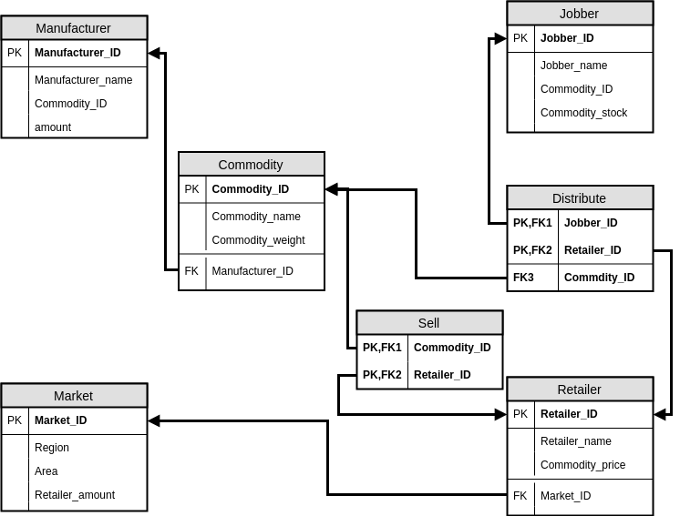
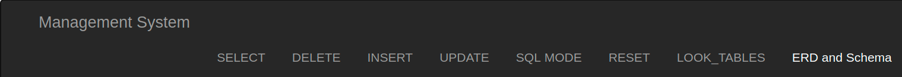

# DBMS-Project-Traceability

A simple website that simulate the management system of product traceability.

#### Table of Contents
* [DBMS-Project-Traceability](#dbms-project-traceability)
    * [Entity-Relationship diagram](#entity-relationship-diagram)
    * [Relation Schema with third normalization](#relation-schema-with-third-normalization)
    * [Environment](#environment)
    * [Build](#build)
    * [Screenshot and Usage](#screenshot-and-usage)
        * [Button](#button)
    * [Explain meaning and relationship](#explain-meaning-and-relationship)
        * [Entity](#entity)
        * [Relationship](#relationship)
        * [to-do](#to-do)

## Entity-Relationship diagram


## Relation Schema with third normalization



## Environment

* Operating system : `Ubuntu 16.04`
* Programming language : `Python 3.5.2`
* GUI : web
* Python web framework : `flask`

## Build

1. clone the repository

```bash
$ git clone https://github.com/e652424342007/DBMS-Project-Traceability.git
```

2. create and activate virtual environment

```bash
$ virtualenv dbms_venv
$ source dbms_venv/bin/activate
```

3. install required Python package with pip

```bash
$ cd DBMS-Project-Traceability
$ pip install -r requirements.txt
```

4. set flask environment

```bash
$ export FLASK_APP=dbms
$ export FLASK_ENV=development
```

5. initialize the **sqlite** database

```bash
$ flask init-schema
$ flask init-data
```

Note: You can use `$ flask` to see what command can be used (at `DBMS-Project-Traceability` directory)

6. lanuch

```bash
$ flask run
```

7. usage
open your browser and enter URL `127.0.0.1:5000` in your browser's URL bar

## Screenshot and Usage

#### Button
<span style="background-color: lightblue; margin: 100px; padding: 10px;">Every embedded SQL is demostrated to highlight block.</span>
<br>
* **`Management System`** : default to display current content of  `Commodity` table
* **`SELECT`** : dropdown list that include `SELECT`, `IN`, `NOT IN`, `EXISTS`, `NOT_EXISTS`, `COUNT`, `SUM`, `MAX`, `MIN`, `AVG`, `HAVING`
* **`DELETE`** 、 **`INSERT`** 、 **`UPDATE`** have embedded SQL as well.
* **`SQL MODE`** : you can enter customized SQL in the here.
* **`RESET`** : reset all of table in database to the default
* **`LOOK_TABLES`** : convenience to check content of tables
* **`ERD and Schema`** : ER-diagram and relation schema about this management system

## Explain meaning and relationship


* <span style="background-color: lightblue; padding: 8px;">我想做一個消費者可以對於產品生產、運送清楚了解的**產品履歷系統**</span>
* <span style="background-color: lightblue; padding: 10px;">也可追蹤是否想要購物的商品有庫存或是有店家在販賣</span>

#### Entity
* `製造商` : 產品製造商 (製造商未必只能製造一種產品，但預設的設計和資料是給一種)
    * `製造商ID` : 製造商的 ID, 為 key
    * `Name` : 製造商名字
    * `商品ID` : 製造的商品
    * `製造數量` : 所製造商品的數量
* `中盤商` : 產品分發商 (可指定分發商的分發區域，目前裡面未加入，例如`東西南北`)
    * `中盤商ID` : 中盤商的 ID, 為 key
    * `Name` : 中盤商名字
    * `商品ID` : 分發的商品 ID (這裡應由 `分發` 這個 relationship 替代)
    * `庫存` : 分發的商品的庫存
* `市場` : 市場或是商圈，販售商的所在地 (可以延伸至與中盤商的 relationship)
    * `市場ID` : 市場的 ID, 為 key
    * `區域` : 市場所在區域
    * `市場面積`
    * `店家數` : 市場內有的店家數量
* `販售商` :  泛指所有販售東西的商家, e.g. 便利商店、雜貨店、專賣店等等
    * `販售商ID` : 販售商的 ID, 為 key
    * `Name` : 販售商名字
    * `商品價錢` : 所販售的商品的價錢 (可不只販售一個商品)
* `商品` : 所有可以想像被製造的商品 (可延伸更多的 attribute，例如: 體積、品質等等)
    * `商品ID` : 枋品的 ID, 為 key
    * `Name` : 商品的名字
    * `Weight` : 商品重量

#### Relationship
* `製造` : 製造商 **製造** 商品
    * `1:N`
        * 所有商品都被某 1 個製造商製造
        * 製造商可製造多個產品
* `位於` : 販售商 **位於** 市場
    * `1:N`
        * 所有販售商都只位於某 1 個市場
        * 所有市場都有販售商，且可有多個 (N)
* `販售` : 販售商 **販售** 商品
    * `M:N`
        * 所有販售商都需販售商品，且可販售多個商品 (M)
        * 所有商品都要被販售，且可由多個販售商販售 (N)
* `分發` : 中盤商 **分發** 商品 **給** 販售商
    * `1:N:M`
        * `1` : 1 個中盤商 可分發給 1 販售商 1 種產品 (作為簡化的假設)
        * `N` : 1 種商品 被分發至 1 個販售商，可由 N 個中盤商分發
        * `M` : 1 個中盤商 可分發 1 種商品 給 M 個販售商

#### to-do
* 可以進一擴展產品的原料
* ERM 和 Schema 可再進行優化
